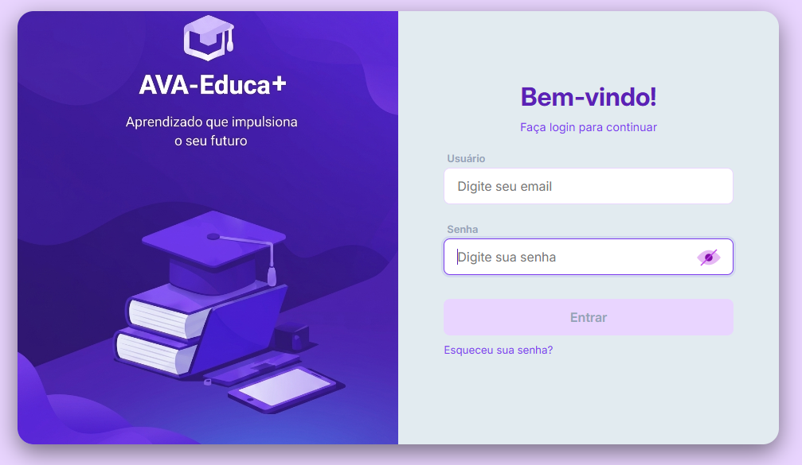
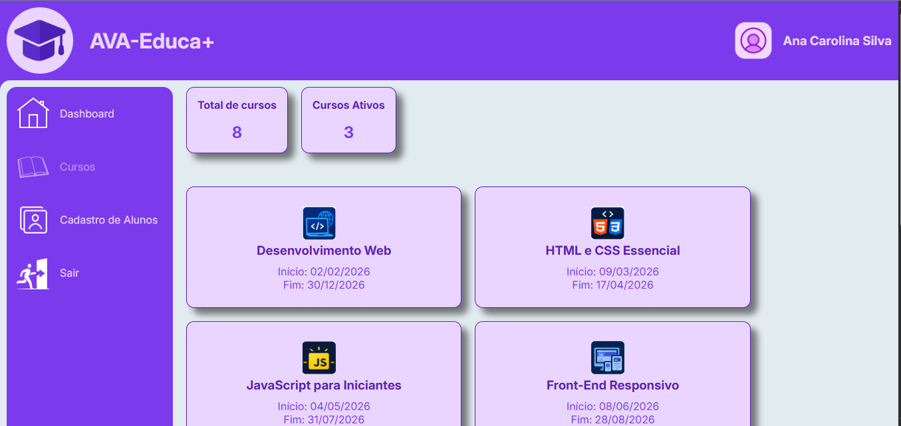
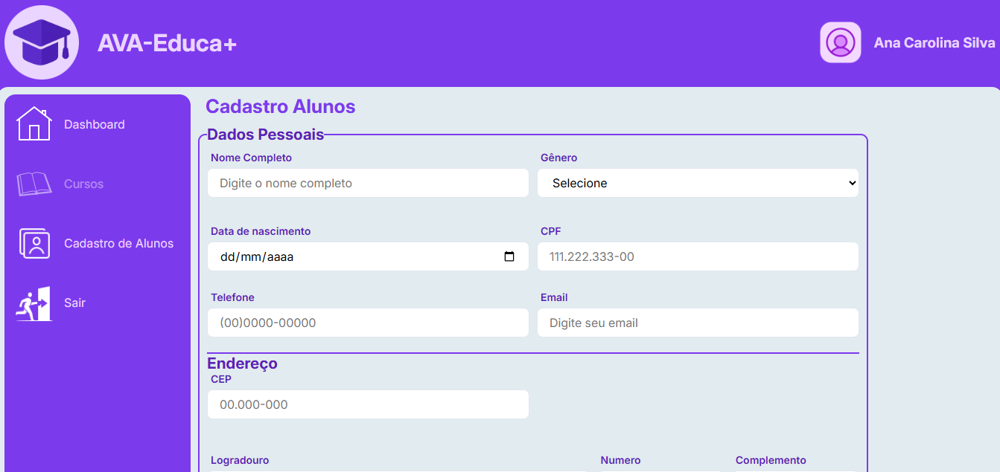

# AVA-EducaPlus

# AVA-Educa+

## 📚 Descrição

O **AVA-Educa+** é um sistema desenvolvido para simular um Ambiente Virtual de Aprendizagem (AVA), permitindo o gerenciamento de usuários, cursos e alunos.

O projeto busca facilitar a organização das informações acadêmicas em um único ambiente, oferecendo autenticação, dashboard e cadastro de alunos com validação dos dados.

---

## 🛠️ Tecnologias e Técnicas

- **HTML5** – estrutura das páginas e formulários.
- **CSS3** – estilização e responsividade.
- **JavaScript** – lógica e interação do sistema.
- **Moment.js** – validação e formatação de datas.
- **ViaCEP API** – consulta automática de endereços pelo CEP.
- **SessionStorage** – armazenamento da sessão do usuário.
- **Fetch API** – consumo da API ViaCEP.
- **ES Modules** – organização através de `import` e `export`.
- **Classes e Promises** – organização e tratamento das operações do sistema.
- **Flexbox, Grid e Media Queries** – desenvolvimento responsivo.

---

## 📂 Estrutura do Projeto

```text
AVA-EducaPlus/
│
├── assets/
├── cadastro-alunos/
├── dashboard/
├── login/
├── dados/
├── js/
├── css/
├── index.html
├── package.json
└── README.md

## ▶️ Como executar

### 1. Clone o repositório

```bash
git clone 

### 2. Entre na pasta

```cd AVA-EducaPlus

### 3. Execute o projeto

```index.html

### O sistema irá direcionar para a tela de login.

### Os usuários para teste estão disponíveis em:

```dados/listagem-usuarios.js

## Prints – Web

### Login

📷 

### Dashboard

📷 

### Cadastro de Alunos

📷 

## 📱 Prints – Mobile

### Login

📷 

### Dashboard

📷 

### Cadastro de Alunos

📷 

## 🔮 Melhorias Futuras

### Algumas melhorias que podem ser implementadas:

* Criar um backend com Node.js.
* Utilizar um banco de dados para persistência das informações.
* Implementar autenticação com JWT.
* Criar CRUD completo de alunos e cursos.
* Implementar diferentes níveis de acesso para usuários.
* Desenvolver uma aplicação mobile.
* Melhorar acessibilidade e experiência do usuário.

## 👨‍💻 Projeto

Projeto desenvolvido como atividade prática para aplicação de conhecimentos em HTML, CSS e JavaScript, utilizando modularização, orientação a objetos, APIs e desenvolvimento responsivo.
